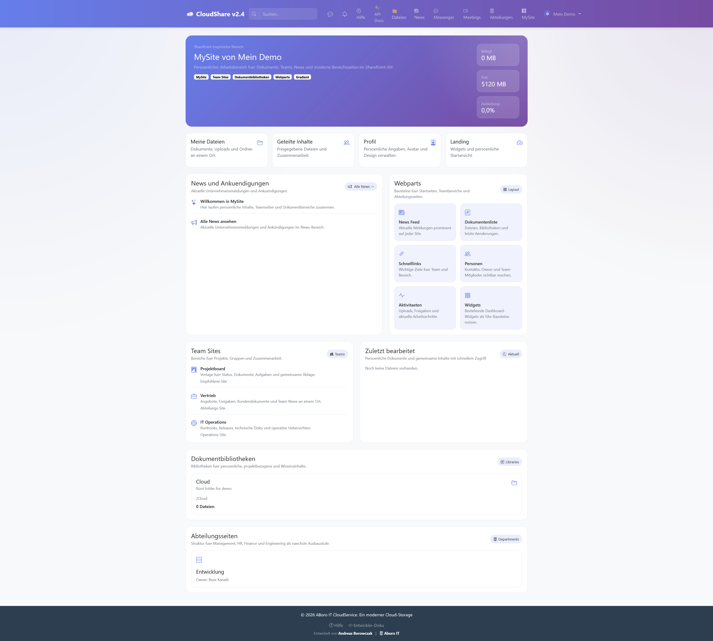
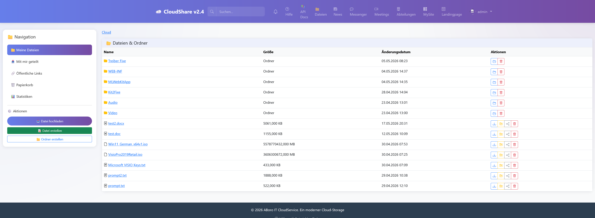
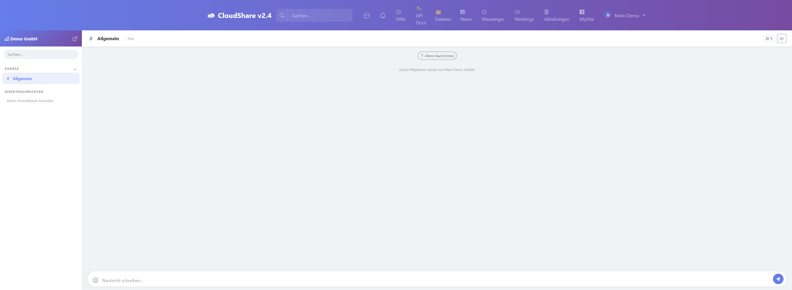
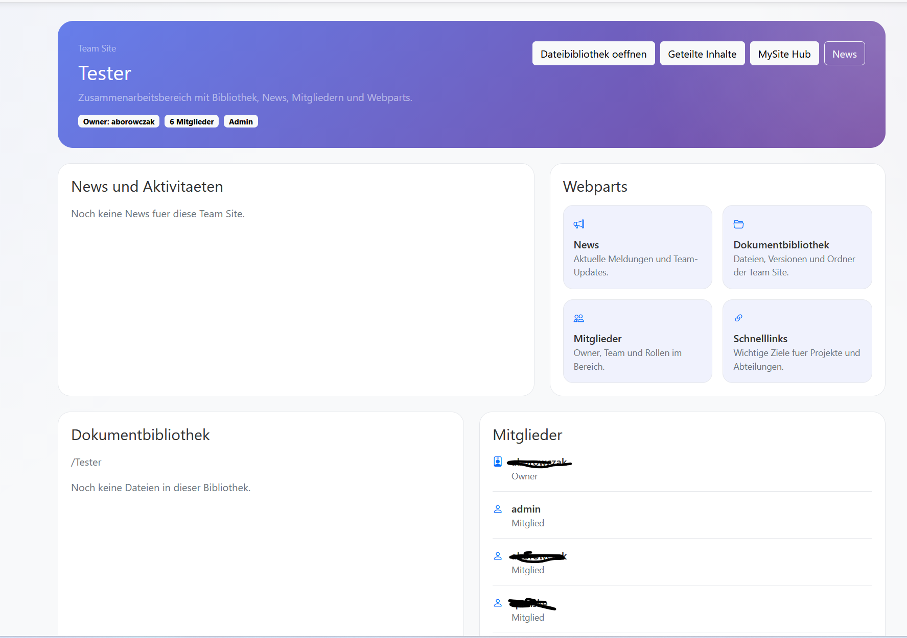
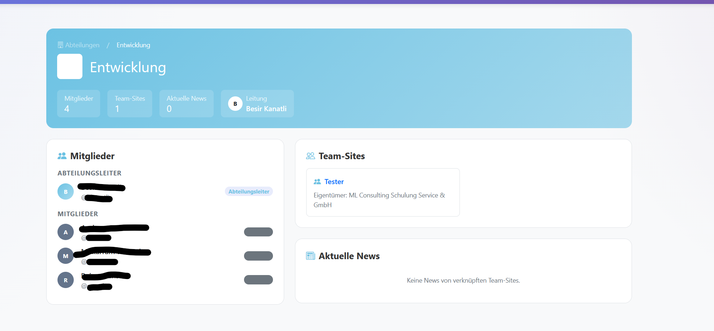
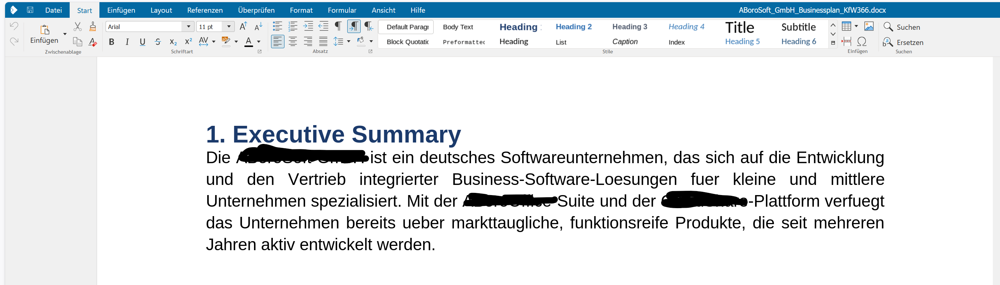

# Cloude — Self-Hosted Company Intranet

> **The SharePoint alternative that keeps your data on your own server.**  
> Full intranet platform — file storage, messenger, video calls, news, team sites, and more.  
> Self-hosted. GDPR-compliant. German UI. No per-user fees.

[](https://cloudshare.aborosoft.com)
[](LICENSE)
[](https://python.org)
[](https://djangoproject.com)
[](https://getbootstrap.com)

---

## Try it now — Live Demo

**[cloudshare.aborosoft.com](https://cloudshare.aborosoft.com)**

| Login | Password |
|---|---|
| `demo` | `demo` |

---

## Why Cloude?

| The problem with SharePoint / Microsoft 365 | How Cloude solves it |
|---|---|
| €10–25 per user per month | Self-hosted — pay once for your server |
| Data stored in Microsoft's cloud | Your data stays on **your** server |
| Complex licensing and admin | Simple Django admin + friendly web UI |
| Vendor lock-in | Open source, you own the code |
| Requires Active Directory / Azure | Works standalone, plain user accounts |

---

## Screenshots

| Dashboard (MySite) | File Storage | Messenger |
|---|---|---|
|  |  |  |

| News | Team Sites | Page Editor |
|---|---|---|
|  |  |  |

---

## Features

### Core Platform

| | Feature | Description |
|---|---|---|
| 📁 | **File Storage** | Upload, download, rename, move, versioning, recycle bin, file preview (images, PDF, video, audio) |
| 🔗 | **Sharing** | Public links with password protection and expiry date |
| 💬 | **Real-time Messenger** | Channels, direct messages, emoji reactions, threaded replies, online presence |
| 📹 | **Video Calls** | Peer-to-peer video calls in DM windows (Jitsi, self-hostable) |
| 📅 | **Meeting Scheduler** | Plan and run video meetings with invitees, embedded Jitsi room |
| 📰 | **Company News** | Magazine-style news with categories, reactions, threaded comments |
| 🏢 | **Team Sites** | Departmental sites with their own news, files, and members |
| 👤 | **People Directory** | Employee profiles, org chart, contact cards |
| ✅ | **Kanban Boards** | Visual task boards per team or project |
| 🌐 | **REST API** | Full JWT-authenticated API, Swagger docs at `/api/docs/` |
| 🔌 | **Plugin System** | Extend with hook-based plugins, zero core changes needed |

### Bundled Plugins

| Plugin | What it does |
|---|---|
| **MySite Hub** | Personal dashboard — your news, files, meetings, team widgets in one place |
| **Landing Editor** | Visual drag-and-drop page editor (GrapesJS) for your company's start page |
| **Collabora Online** | In-browser Office document editing (requires Collabora server) |
| **Forms Builder** | Create and publish internal forms |
| **Tasks Board** | Kanban-style task management |
| **People Directory** | Searchable employee directory |
| **RSS Feed** | Dashboard widget for external news feeds |
| **Weather** | Dashboard weather widget |
| **Clock** | Dashboard clock widget |

---

## Quick Install (1-Click)

> **Requires:** Ubuntu 22.04 / Debian 12, root or sudo access

```bash
curl -fsSL https://raw.githubusercontent.com/aboro72/Cloude/master/install.sh | sudo bash
```

The script installs all dependencies, configures systemd services, and sets up Nginx automatically.  
At the end it prints your admin URL and asks you to create the first user.

---

## Manual Install

<details>
<summary>Full step-by-step installation guide (click to expand)</summary>

### System Requirements

| Component | Minimum version |
|---|---|
| OS | Ubuntu 22.04 LTS or Debian 12 |
| Python | 3.11+ |
| PostgreSQL | 14+ |
| Redis | 7+ |
| Nginx | 1.18+ |
| RAM | 1 GB (2 GB recommended) |

### Step 1 — System user and repository

```bash
sudo useradd -m -s /bin/bash storage
sudo su - storage

git clone https://github.com/aboro72/Cloude.git
cd Cloude

python3 -m venv venv
source venv/bin/activate
pip install -r requirements.txt
```

### Step 2 — Configure environment

```bash
cp .env.example cloudservice/.env
nano cloudservice/.env
```

Key variables to set:

```env
SECRET_KEY=<generate-with-python-secrets>
ALLOWED_HOSTS=your-domain.com
DB_NAME=cloudservice
DB_USER=postgres
DB_PASSWORD=<your-db-password>
DB_HOST=localhost
REDIS_URL=redis://localhost:6379/0
```

Generate a secure key:
```bash
python3 -c "import secrets; print(secrets.token_urlsafe(50))"
```

### Step 3 — Database and static files

```bash
cd cloudservice
python manage.py migrate
python manage.py collectstatic --noinput
python manage.py createsuperuser
```

### Step 4 — Systemd services

```bash
sudo cp /home/storage/Cloude/gunicorn.service  /etc/systemd/system/
sudo cp /home/storage/Cloude/daphne.service    /etc/systemd/system/
sudo systemctl daemon-reload
sudo systemctl enable --now gunicorn daphne
```

### Step 5 — Nginx

```bash
sudo cp /home/storage/Cloude/nginx.conf /etc/nginx/sites-available/cloude
sudo ln -s /etc/nginx/sites-available/cloude /etc/nginx/sites-enabled/
sudo nginx -t && sudo systemctl reload nginx
```

### Step 6 — (Optional) Automatic updates from GitHub

```bash
sudo cp /home/storage/Cloude/auto-update.sh /usr/local/bin/cloude-auto-update.sh
sudo chmod +x /usr/local/bin/cloude-auto-update.sh
sudo cp /home/storage/Cloude/auto-update.service /etc/systemd/system/
sudo cp /home/storage/Cloude/auto-update.timer   /etc/systemd/system/
sudo touch /var/log/cloude-autoupdate.log
sudo chown storage:storage /var/log/cloude-autoupdate.log
sudo systemctl daemon-reload
sudo systemctl enable --now auto-update.timer
```

This pulls the latest `master` commits every 5 minutes, runs migrations, and restarts services automatically.

</details>

---

## Tech Stack

| Layer | Technology |
|---|---|
| Backend | Django 6, Django REST Framework, Celery |
| Real-time | Django Channels, Daphne (ASGI), WebSocket |
| Frontend | Bootstrap 5.3, Bootstrap Icons, vanilla JS |
| Page builder | GrapesJS 0.21 |
| Database | PostgreSQL (or MySQL) |
| Cache / Queue | Redis |
| Web server | Nginx + Gunicorn + Daphne |
| Auth | JWT (djangorestframework-simplejwt) |

---

## Troubleshooting

<details>
<summary>Common issues and fixes</summary>

**502 Bad Gateway**
```bash
sudo systemctl status gunicorn
sudo journalctl -u gunicorn -n 50
sudo systemctl restart gunicorn
```

**Static files missing**
```bash
source /home/storage/Cloude/venv/bin/activate
python /home/storage/Cloude/cloudservice/manage.py collectstatic --noinput
```

**Migration errors**
```bash
python manage.py migrate --fake-initial
```

**Auto-update not running**
```bash
sudo /usr/local/bin/cloude-auto-update.sh
tail -50 /var/log/cloude-autoupdate.log
```

</details>

---

## REST API

Base URL: `/api/`  
Auth: JWT — `POST /api/auth/token/`  
Swagger UI: `/api/docs/`  
ReDoc: `/api/redoc/`

Endpoints cover: files, folders, shares, notifications, departments, team sites, news, meetings, kanban boards, messenger rooms and messages.

---

## License

MIT License — see [LICENSE](LICENSE)

---

## Support & Contact

- **Issues:** [GitHub Issues](https://github.com/aboro72/Cloude/issues)
- **Developer:** Andreas Borowczak · [Aboro IT](https://aboro-it.de)
- **Demo:** [cloudshare.aborosoft.com](https://cloudshare.aborosoft.com)
